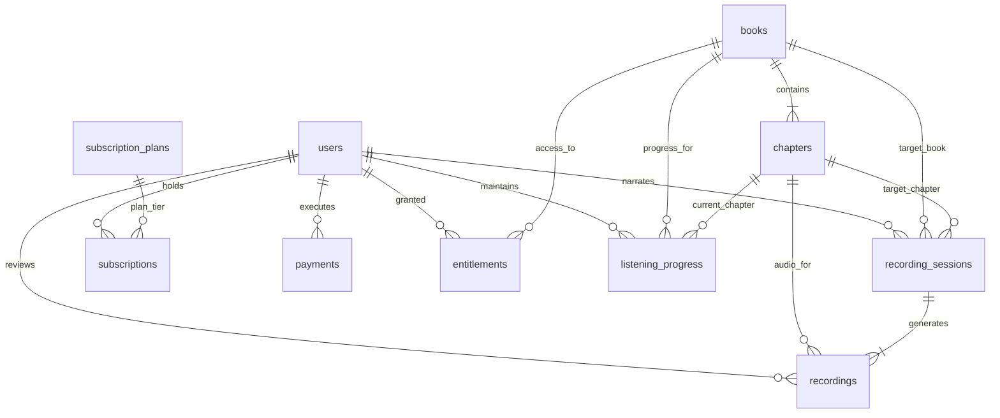

# Bolti Kitab (بولتی کتاب)
## Initial Phase 1 PostgreSQL schema/migration baseline Reference

> **Authoritative Engine**: PostgreSQL 16 (Compatible with PostgreSQL 16+)  
> **Schema Migration**: [`database/migrations/001_initial_phase1_schema.sql`](file:///c:/Users/Sadia%20Ahmad/BoltiKitab/database/migrations/001_initial_phase1_schema.sql)  
> **Extension Required**: `uuid-ossp` (provides `uuid_generate_v4()`)

---

## 1. Entity-Relationship Diagram



---

## 2. Table Specifications & Constraints

### 1. `users`
Identity and role-based access control table.
- `id` (UUID, PK): `DEFAULT uuid_generate_v4()`.
- `email` (VARCHAR(255), UNIQUE, NOT NULL): Normalized login email.
- `password_hash` (VARCHAR(255), NOT NULL): Argon2id password hash.
- `full_name` (VARCHAR(128), NOT NULL): Display name of user / narrator / admin.
- `role` (VARCHAR(32), NOT NULL, DEFAULT `'listener'`): Check constraint `IN ('listener', 'narrator', 'editor', 'admin')`.
- `status` (VARCHAR(32), NOT NULL, DEFAULT `'active'`): Check constraint `IN ('active', 'suspended', 'pending_verification')`.
- `created_at` (TIMESTAMPTZ, NOT NULL, DEFAULT CURRENT_TIMESTAMP).
- `updated_at` (TIMESTAMPTZ, NOT NULL, DEFAULT CURRENT_TIMESTAMP).

### 2. `books`
Audiobook and spoken literature metadata.
- `id` (UUID, PK): `DEFAULT uuid_generate_v4()`.
- `title` (VARCHAR(255), NOT NULL): Latin/English title for SEO and search.
- `title_urdu` (VARCHAR(255), NOT NULL): Native Nastaliq Urdu title.
- `author` (VARCHAR(128), NOT NULL): Literary author name.
- `narrator_name` (VARCHAR(128), NOT NULL): Credited voice artist name.
- `synopsis` (TEXT): Detailed description and literary context.
- `language` (VARCHAR(32), NOT NULL, DEFAULT `'ur'`): Check constraint `IN ('ur', 'en', 'pa', 'sd')`.
- `duration_seconds` (INTEGER, NOT NULL, DEFAULT 0): Check constraint `duration_seconds >= 0`.
- `price_cents` (INTEGER, NOT NULL, DEFAULT 0): Check constraint `price_cents >= 0`.
- `currency` (VARCHAR(8), NOT NULL, DEFAULT `'PKR'`).
- `cover_object_key` (VARCHAR(512)): Cloud object storage key for cover art.
- `status` (VARCHAR(32), NOT NULL, DEFAULT `'draft'`): Check constraint `IN ('draft', 'in_recording', 'in_review', 'active', 'archived')`.
- `published_at` (TIMESTAMPTZ): Timestamp when status changed to `active`.
- `created_at` (TIMESTAMPTZ, NOT NULL, DEFAULT CURRENT_TIMESTAMP).
- `updated_at` (TIMESTAMPTZ, NOT NULL, DEFAULT CURRENT_TIMESTAMP).

### 3. `chapters`
Ordered chapters and audio segments for books.
- `id` (UUID, PK): `DEFAULT uuid_generate_v4()`.
- `book_id` (UUID, FK -> `books(id)` ON DELETE CASCADE, NOT NULL).
- `chapter_num` (INTEGER, NOT NULL): Monotonic sequence number (`chapter_num >= 1`).
- `title` (VARCHAR(255), NOT NULL): English/transliterated title.
- `title_urdu` (VARCHAR(255)): Urdu chapter title.
- `start_ms` (INTEGER, NOT NULL, DEFAULT 0): Absolute start offset in milliseconds within the complete audiobook timeline (`start_ms >= 0`).
- `end_ms` (INTEGER, NOT NULL, DEFAULT 0): Absolute end offset in milliseconds within the complete audiobook timeline.
- `duration_ms` (INTEGER, NOT NULL, DEFAULT 0): Segment duration in milliseconds (`duration_ms >= 0`).
- `audio_object_key` (VARCHAR(512)): Storage key pointing to approved master audio.
- `is_preview_free` (BOOLEAN, NOT NULL, DEFAULT FALSE): Allows sample listening without entitlement.
- `status` (VARCHAR(32), NOT NULL, DEFAULT `'pending'`): Check constraint `IN ('pending', 'recorded', 'approved', 'rejected')`.
- `created_at` (TIMESTAMPTZ, NOT NULL, DEFAULT CURRENT_TIMESTAMP).
- `updated_at` (TIMESTAMPTZ, NOT NULL, DEFAULT CURRENT_TIMESTAMP).
- **Constraints**:
  - `CONSTRAINT uq_book_chapter_num UNIQUE (book_id, chapter_num)`
  - `CONSTRAINT uq_chapters_book_id_pair UNIQUE (book_id, id)` (Enables composite referential integrity)
  - `CONSTRAINT chk_chapters_timing CHECK (end_ms >= start_ms AND duration_ms = (end_ms - start_ms))`

### 4. `recording_sessions`
Narrator studio recording sessions.
- `id` (UUID, PK): `DEFAULT uuid_generate_v4()`.
- `narrator_id` (UUID, FK -> `users(id)`, NOT NULL).
- `book_id` (UUID, FK -> `books(id)` ON DELETE CASCADE, NOT NULL).
- `chapter_id` (UUID, NOT NULL).
- `status` (VARCHAR(32), NOT NULL, DEFAULT `'in_progress'`): Check constraint `IN ('in_progress', 'completed', 'abandoned')`.
- `notes` (TEXT): Narrator or studio engineer session notes.
- `created_at` (TIMESTAMPTZ, NOT NULL, DEFAULT CURRENT_TIMESTAMP).
- `updated_at` (TIMESTAMPTZ, NOT NULL, DEFAULT CURRENT_TIMESTAMP).
- **Constraints**:
  - `CONSTRAINT fk_sessions_book_chapter FOREIGN KEY (book_id, chapter_id) REFERENCES chapters(book_id, id) ON DELETE CASCADE` (Guarantees chapter belongs to book)
  - `CONSTRAINT uq_sessions_id_chapter UNIQUE (id, chapter_id)` (Enables composite referential integrity for takes)

### 5. `recordings`
Audio takes captured during a recording session.
- `id` (UUID, PK): `DEFAULT uuid_generate_v4()`.
- `session_id` (UUID, NOT NULL).
- `chapter_id` (UUID, NOT NULL).
- `take_number` (INTEGER, NOT NULL, DEFAULT 1): Incrementing take attempt (`take_number >= 1`).
- `raw_audio_key` (VARCHAR(512), NOT NULL): Storage key of raw uploaded take.
- `duration_ms` (INTEGER, NOT NULL, DEFAULT 0): Verified audio duration (`duration_ms >= 0`).
- `file_size_bytes` (BIGINT, NOT NULL, DEFAULT 0): Verified raw take byte count (`file_size_bytes >= 0`).
- `sample_rate_hz` (INTEGER, NOT NULL, DEFAULT 44100): Check constraint `sample_rate_hz IN (22050, 44100, 48000)`.
- `channels` (INTEGER, NOT NULL, DEFAULT 2): Check constraint `channels IN (1, 2)`.
- `status` (VARCHAR(32), NOT NULL, DEFAULT `'submitted_for_review'`): Check constraint `IN ('uploading', 'submitted_for_review', 'approved', 'rejected')`.
- `review_notes` (TEXT): Editor / sound reviewer critique or comments.
- `reviewed_by` (UUID, FK -> `users(id)` ON DELETE SET NULL): Preserves recording if reviewer account is deleted.
- `reviewed_at` (TIMESTAMPTZ): Approval or rejection timestamp.
- `created_at` (TIMESTAMPTZ, NOT NULL, DEFAULT CURRENT_TIMESTAMP).
- `updated_at` (TIMESTAMPTZ, NOT NULL, DEFAULT CURRENT_TIMESTAMP).
- **Constraints**:
  - `CONSTRAINT uq_session_take UNIQUE (session_id, take_number)`
  - `CONSTRAINT fk_recordings_session_chapter FOREIGN KEY (session_id, chapter_id) REFERENCES recording_sessions(id, chapter_id) ON DELETE CASCADE`

### 6. `subscription_plans`
Membership pricing tiers.
- `id` (UUID, PK): `DEFAULT uuid_generate_v4()`.
- `name` (VARCHAR(64), NOT NULL): Plan title.
- `billing_interval` (VARCHAR(16), NOT NULL): Check constraint `IN ('monthly', 'annual')`.
- `price_cents` (INTEGER, NOT NULL): Cost in currency subunits (`price_cents >= 0`).
- `currency` (VARCHAR(8), NOT NULL, DEFAULT `'PKR'`).
- `is_active` (BOOLEAN, NOT NULL, DEFAULT TRUE): Controls visibility on storefront.
- `created_at` (TIMESTAMPTZ, NOT NULL, DEFAULT CURRENT_TIMESTAMP).
- `updated_at` (TIMESTAMPTZ, NOT NULL, DEFAULT CURRENT_TIMESTAMP).

### 7. `subscriptions`
Customer recurring subscription state.
- `id` (UUID, PK): `DEFAULT uuid_generate_v4()`.
- `user_id` (UUID, FK -> `users(id)` ON DELETE CASCADE, NOT NULL).
- `plan_id` (UUID, FK -> `subscription_plans(id)`, NOT NULL).
- `status` (VARCHAR(32), NOT NULL, DEFAULT `'active'`): Check constraint `IN ('active', 'past_due', 'canceled', 'expired')`.
- `gateway_subscription_id` (VARCHAR(128)): Subscription identifier from Stripe / payment processor.
- `current_period_start` (TIMESTAMPTZ, NOT NULL).
- `current_period_end` (TIMESTAMPTZ, NOT NULL).
- `created_at` (TIMESTAMPTZ, NOT NULL, DEFAULT CURRENT_TIMESTAMP).
- `updated_at` (TIMESTAMPTZ, NOT NULL, DEFAULT CURRENT_TIMESTAMP).
- **Constraints**:
  - `CONSTRAINT chk_subscription_periods CHECK (current_period_end > current_period_start)`: Strictly positive interval.
  - Partial Unique Index: `uq_subscriptions_gateway_id UNIQUE (gateway_subscription_id) WHERE gateway_subscription_id IS NOT NULL`.

### 8. `payments`
Financial transaction audit records, webhook idempotency, and direct book purchase / subscription tracking.
- `id` (UUID, PK): `DEFAULT uuid_generate_v4()`.
- `user_id` (UUID, FK -> `users(id)` ON DELETE RESTRICT, NOT NULL): Prevents hard-deletion of users with financial records.
- `payment_type` (VARCHAR(32), NOT NULL, DEFAULT `'direct_purchase'`): Check constraint `IN ('direct_purchase', 'subscription')`.
- `book_id` (UUID, FK -> `books(id)` ON DELETE RESTRICT): Explicitly identifies purchased book for direct book sales.
- `subscription_id` (UUID, FK -> `subscriptions(id)` ON DELETE SET NULL): Optional link for subscription invoice charges.
- `gateway` (VARCHAR(32), NOT NULL): Check constraint `IN ('stripe', 'jazzcash', 'easypaisa', 'manual')`.
- `gateway_tx_id` (VARCHAR(128), NOT NULL, UNIQUE): Upstream transaction ID used for idempotency.
- `amount_cents` (INTEGER, NOT NULL): Total transaction amount (`amount_cents >= 0`).
- `currency` (VARCHAR(8), NOT NULL, DEFAULT `'PKR'`).
- `status` (VARCHAR(32), NOT NULL): Check constraint `IN ('pending', 'succeeded', 'failed', 'refunded')`.
- `created_at` (TIMESTAMPTZ, NOT NULL, DEFAULT CURRENT_TIMESTAMP).
- `updated_at` (TIMESTAMPTZ, NOT NULL, DEFAULT CURRENT_TIMESTAMP).
- **Constraints**:
  - `CONSTRAINT chk_payment_target CHECK ((payment_type = 'direct_purchase' AND book_id IS NOT NULL AND subscription_id IS NULL) OR (payment_type = 'subscription' AND subscription_id IS NOT NULL AND book_id IS NULL))`: Mathematically guarantees that every payment is strictly associated with exactly one target (either a direct book purchase or a subscription).

### 9. `entitlements`
Playback authorization records granting users access to specific audiobooks.
- `id` (UUID, PK): `DEFAULT uuid_generate_v4()`.
- `user_id` (UUID, FK -> `users(id)` ON DELETE CASCADE, NOT NULL).
- `book_id` (UUID, FK -> `books(id)` ON DELETE CASCADE, NOT NULL).
- `grant_type` (VARCHAR(32), NOT NULL): Check constraint `IN ('subscription', 'direct_purchase', 'promotional')`.
- `status` (VARCHAR(32), NOT NULL, DEFAULT `'active'`): Check constraint `IN ('active', 'revoked', 'expired')`.
- `expires_at` (TIMESTAMPTZ): Nullable expiration for timed access / subscriptions.
- `created_at` (TIMESTAMPTZ, NOT NULL, DEFAULT CURRENT_TIMESTAMP).
- `updated_at` (TIMESTAMPTZ, NOT NULL, DEFAULT CURRENT_TIMESTAMP).
- **Constraints**:
  - `CONSTRAINT uq_user_book_grant UNIQUE (user_id, book_id, grant_type)`: Permits distinct concurrent grants (e.g. lifetime direct purchase alongside active subscription) without collision.

### 10. `listening_progress`
Tracks the exact playback position per user and book across sessions and devices.
- `user_id` (UUID, FK -> `users(id)` ON DELETE CASCADE, NOT NULL).
- `book_id` (UUID, FK -> `books(id)` ON DELETE CASCADE, NOT NULL).
- `chapter_id` (UUID, NOT NULL).
- `position_ms` (INTEGER, NOT NULL, DEFAULT 0): Check constraint `position_ms >= 0`. **Represents playback offset (in ms) within the CURRENT CHAPTER, not the entire audiobook.**
- `update_seq` (BIGINT, NOT NULL, DEFAULT 1): Check constraint `update_seq >= 1`.
- `is_completed` (BOOLEAN, NOT NULL, DEFAULT FALSE).
- `updated_at` (TIMESTAMPTZ, NOT NULL, DEFAULT CURRENT_TIMESTAMP).
- **Primary Key**: `(user_id, book_id)`.
- **Constraints**:
  - `CONSTRAINT fk_progress_book_chapter FOREIGN KEY (book_id, chapter_id) REFERENCES chapters(book_id, id) ON DELETE CASCADE`: Prevents assigning progress to a chapter of a different book.

---

## 3. Performance & Filtered Indexes

```sql
-- Fast catalog querying by publication status, language, and recency
CREATE INDEX idx_books_status_lang_pub ON books(status, language, published_at DESC);

-- Fast chapter ordering and lookup by book
CREATE INDEX idx_chapters_book_num ON chapters(book_id, chapter_num);

-- Filtered index for pending moderation/review queue queries ordered by arrival
CREATE INDEX idx_recordings_review_queue ON recordings(status, created_at ASC) WHERE status = 'submitted_for_review';

-- High-performance authorization lookup during playback token generation (<15ms)
CREATE INDEX idx_entitlements_user_book_active ON entitlements(user_id, book_id, status) WHERE status = 'active';

-- Fast studio session loading for narrators
CREATE INDEX idx_recording_sessions_narrator ON recording_sessions(narrator_id, status);

-- Partial unique index preventing duplicate external subscription IDs across subscriptions
CREATE UNIQUE INDEX uq_subscriptions_gateway_id 
ON subscriptions(gateway_subscription_id) 
WHERE gateway_subscription_id IS NOT NULL;

-- Fast purchase history and user financial audit lookup
CREATE INDEX idx_payments_user_history 
ON payments(user_id, created_at DESC);
```
