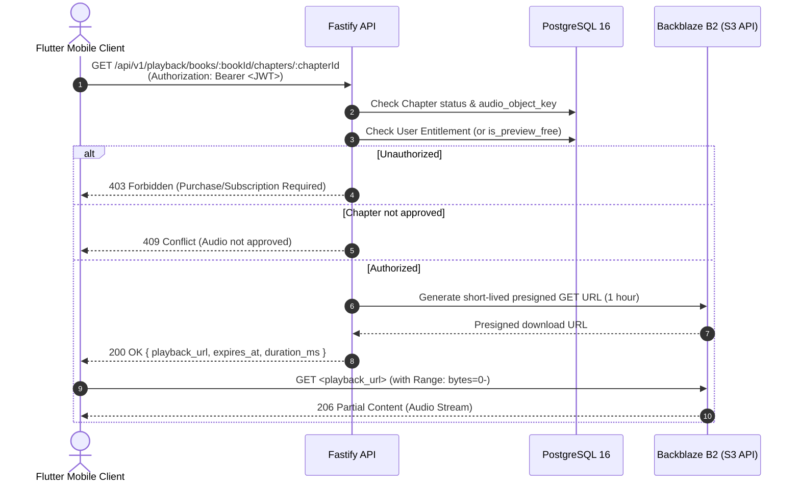

# Playback & Listening Progress Authorization Flow

This document details the architectural flow, security guarantees, and API contract for audio streaming and listening progress synchronization in **Bolti Kitab (بولتی کتاب)**.

---

## 1. Security Contract & Rules

1. **No Backend Audio Proxying**:
   - Audio files are stored in private Backblaze B2 object storage (or alternate Azure Blob Storage).
   - The backend **never** downloads or streams audio binaries through its Fastify Node.js process.
2. **Short-Lived Delegation**:
   - Authorized clients receive a signed, time-limited presigned download URL (e.g., 60 minutes) with strict read-only permissions.
   - Presigned URLs support standard HTTP `Range` requests (`206 Partial Content`) for instantaneous seeking and byte-range streaming.
3. **Entitlement & Access Enforcement**:
   - `is_preview_free === true` chapters are streamable by any authenticated listener.
   - Non-preview chapters require an active grant in the `entitlements` table (or `editor` / `admin` role).
   - Chapters must be in `status = 'approved'` with a valid `audio_object_key`.
4. **Mobile Only**:
   - Playback is restricted to the mobile client applications. Public web catalog APIs never expose `audio_object_key` or stream tokens.

---

## 2. Playback Authorization Sequence

---

## 3. Listening Progress Synchronization

Progress represents playback offset within the current chapter:

- **Key**: Composite `(user_id, book_id)`.
- **Field**: `chapter_id`, `position_ms` (milliseconds offset within `chapter_id`), `update_seq` (monotonic increment for optimistic concurrency), `is_completed`.
- **API**:
  - `GET /api/v1/playback/books/:bookId/progress`: Retrieves current resume point.
  - `PUT /api/v1/playback/books/:bookId/progress`: Updates playback position on pause, seek, or periodic timer (every 10–15s).
